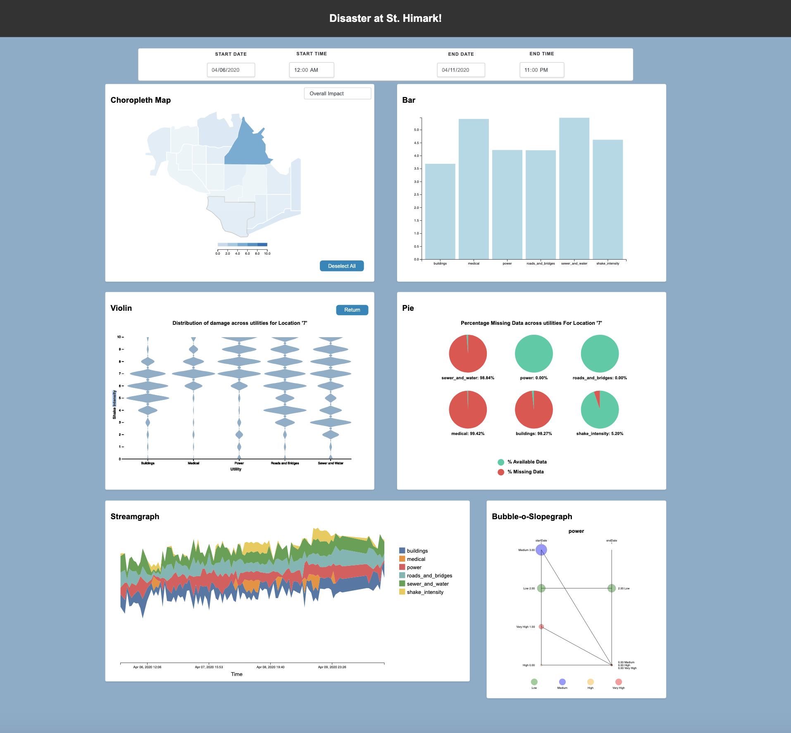

# Disaster at St. Himark - Data Visualization Project

This project, completed as part of **CSE 598: Data Visualization** at Arizona State University, addresses the **2019 VAST Mini Challenge 1**. The project focuses on providing visual analytics to support emergency responders in prioritizing neighborhoods and assessing damage following a seismic event in St. Himark.

## Project Overview

Using **D3.js** and other JavaScript libraries, this dashboard synthesizes seismic data, citizen reports, and city infrastructure data to guide emergency planners. The visualization framework is based on the **Five Design Sheet Methodology**, promoting structured design and iterative development.

---
## Complete Dashboard

## Dashboard Features

1. **Choropleth Map and Bar Chart**
   Provides a comprehensive view of impacted regions, with user interaction features like detailed breakdowns upon clicking a neighborhood. The color saturation indicates severity, aiding quick prioritization.
   
    
   
2. **Violin Chart**  
   Visualizes the distribution of shake intensity across neighborhoods, enabling comparative analysis of seismic impact and report reliability.

    

3. **Interactive Pie Charts**  
   Illustrates missing data patterns across different utilities within neighborhoods, helping to assess the reliability of neighborhood reports.

   ) 

4. **Stream Graph**  
   Displays temporal changes in utility conditions, highlighting trends and spikes in utility disruptions over time.

   )

5. **Bubble-o-Slope Graph**  
   Combines a bubble chart and slope graph to depict shifts in utility conditions across timeframes, assisting in understanding variations in utility impact.

   )

---

## Key Skills and Tools

- **D3.js** for interactive visualizations
- **Data Cleaning and Processing** for ensuring data integrity
- **Interactive Dashboard Development** with user-centered design
- **Statistical Visualization Techniques** including choropleth maps, violin plots, and stream graphs

---

## Contributions

- **Visualization Strategy:** Conceptualized visualization approaches and implemented diverse visualizations.
- **Design Sheet Development:** Created initial project design documents, guiding visualization architecture.
- **Data Sourcing and Cleaning:** Ensured quality and reliability of data used in visualizations.
- **Interactive Features:** Led the development of tooltips, dropdown menus, and dynamic charts.
- **Debugging and Quality Assurance:** Ensured smooth functionality across all project stages.

---

## Insights and Results

The visualizations provide actionable insights for emergency response planning by:
- **Identifying heavily impacted regions** for resource allocation
- **Assessing data reliability** across neighborhoods
- **Tracking temporal changes** in utility conditions post-earthquake

---

## References

- [VAST 2019 Mini Challenge 1](https://vast-challenge.github.io/2019/MC1.html)
- [D3.js Documentation](https://d3js.org/)
- [The D3 Graph Gallery](https://d3-graph-gallery.com/choropleth.html)
